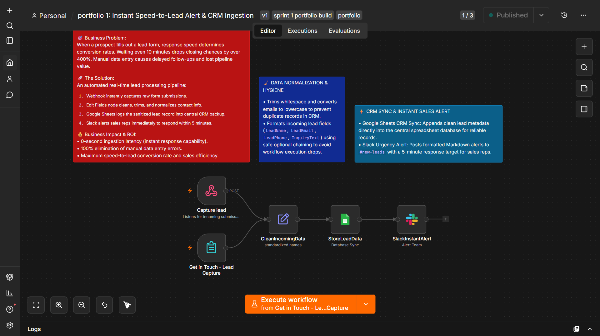

# Instant Speed-to-Lead Alert & CRM Ingestion

## 📹 Demo Walkthrough
Watch the 4-minute live walkthrough of the automated pipeline:
[Watch Automated CRM Lead Ingestion Demo on Loom](https://www.loom.com/share/707c78cf35df44a4adf3ee1a04d75b57)

## 🎯 Business Problem
When a prospective client fills out a lead form, response speed dictates conversion. Studies show that waiting even 10 minutes drops closing rates by over 400%. Manual data entry and delayed notifications cause lost pipeline revenue.

## 🚀 The Solution
An automated real-time lead ingestion pipeline built in n8n:
1. **Webhook Capture:** Ingests form submissions instantly with zero latency.
2. **Data Normalization:** Trims extra whitespace, lowercases email addresses, and applies optional chaining to handle missing fields without breaking execution.
3. **CRM Sync (Google Sheets):** Appends clean, formatted records into the central CRM database.
4. **Instant Sales Alert (Slack):** Posts a formatted notification to `#new-leads` with a target 5-minute SLA for sales team follow-up.

## 💰 Business Impact & ROI
* **0-Second Lead Ingestion:** Enables immediate response capabilities.
* **100% Data Quality:** Eliminates duplicate and corrupted CRM entries through strict automated normalization.
* **Higher Conversion:** Guarantees sales reps receive real-time alerts on active prospects.

## 🛠️ Architecture & Tech Stack
* **Orchestration:** n8n
* **Nodes:** Webhook, Edit Fields (Set), Google Sheets, Slack
* **Data Hygiene:** JavaScript expressions, String trimming, Lowercasing
